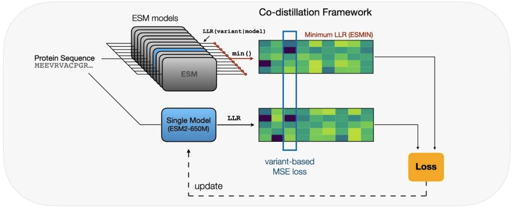

# VESM: Co-distillation of ESM models for Variant Effect Prediction


[](https://colab.research.google.com/github/ntranoslab/vesm/blob/main/notebooks/VESM_Getting_Started.ipynb)

- [Installation ](#installation)
- [Quickstart](#quickstart)
- [Example Usage](#usage)
- [Training & Distillation](#training)
- [Zero-shot Prediction](#inference)
- [License](#license)

This repository contains resources, code and tools for the VESM protein language models developed in the paper ["VESM: Compressing the collective knowledge of ESM into a single protein language model"](vesm_arxiv) by Tuan Dinh, Seon-Kyeong Jang, Noah Zaitlen and Vasilis Ntranos.

<p align="center">
  
</p>

---

- **Proteome-wide‬‭ VESM‬‭ predictions**:‬‭‬‭ Precomputed‬‭ VEP‬‭ scores‬‭ for‬‭ all‬‭ VESM‬‭ models‬ are‬‭ available‬‭‬ at https://huggingface.co/datasets/ntranoslab/vesm_scores

- **Interactive web portal**: VESM‬‭ predictions‬‭ are also available‬‭ in‬‭ an‬‭ interactive‬
web portal at https://huggingface.co/spaces/ntranoslab/vesm-variants

## Installation <a name="installation"></a>

To get started with VESM, you should have PyTorch and [conda](https://www.anaconda.com/) installed to use this repository.
You can follow this command for installing the conda environment:
```bash
conda env create --name vesm --file=environment.yml
```

---
## Quick start <a name="quickstart"></a>
A simple way to get started is to run our notebook [](https://colab.research.google.com/github/ntranoslab/vesm/blob/main/notebooks/VESM_Getting_Started.ipynb) directly on a Google Colab instance.

## Usage  <a name="usage"></a>

Pretrained VESM models can be loaded through our huggingface library: https://huggingface.co/ntranoslab/VESM.
```py
import torch
from huggingface_hub import hf_hub_download
from transformers import AutoTokenizer, EsmForMaskedLM

esm_dict = {
    "VESM_35M": 'facebook/esm2_t12_35M_UR50D',
    "VESM_150M": 'facebook/esm2_t30_150M_UR50D', 
    "VESM_650M": 'facebook/esm2_t33_650M_UR50D', 
    "VESM_3B": 'facebook/esm2_t36_3B_UR50D', 
    "VESM3": "esm3_sm_open_v1"
}
def load_vesm(model_name="VESM_3B", local_dir="vesm", device='cuda'):
    if model_name in esm_dict:
        ckt = esm_dict[model_name]
    else:
        print("Model not found")
        return None

    # download weights
    hf_hub_download(repo_id="ntranoslab/vesm", filename=f"{model_name}.pth", local_dir=local_dir)
    # load base model
    if model_name == "VESM3":
      from esm.models.esm3 import ESM3
      model = ESM3.from_pretrained(ckt, device=device).to(torch.float)
      tokenizer = model.tokenizers.sequence
    else:
      model = EsmForMaskedLM.from_pretrained(ckt).to(device)
      tokenizer = AutoTokenizer.from_pretrained(ckt)
    # load pretrained VESM
    model.load_state_dict(torch.load(f'{local_dir}/{model_name}.pth'), strict=False)
    return model, tokenizer
```


### Predict Variant Effects

```py
# scoring functions
import torch.nn.functional as F
# calculate log-likelihood ratio from the logits 
def get_llrs(sequence_logits, input_ids):
    token_probs = torch.log_softmax(sequence_logits, dim=-1)
    wt_positions = F.one_hot(input_ids, num_classes=token_probs.shape[-1])
    wt_probs = token_probs * wt_positions
    wt_probs = wt_probs.sum(dim=-1, keepdim=True)
    llrs = token_probs - wt_probs.expand(token_probs.shape)
    return llrs

# compute mutation score
def score_mutation(llrs, mutation, sequence_vocabs):
    mutation_score = 0
    for mut in mutation.split(":"):
        _, idx, mt = mut[0], int(mut[1:-1]), mut[-1]
        pred = llrs[idx, sequence_vocabs[mt]] 
        mutation_score += pred.item()
    return mutation_score
```

#### Sequence-only Models 

Here, we provide sample scripts to compute mutation scores.
```py
# sequence and mutation examples
sequence = "MVNSTHRGMHTSLHLWNRSSYRLHSNASESLGKGYSDGGCYEQLFVSPEVFVTLGVISLLENILV"
mutation = "M1Y:V2T"
```

```py
# Setting
local_dir = 'vesm' # local directory to store models
gpu_id = 0 # GPU device
device = torch.device(f'cuda:{gpu_id}') if torch.cuda.is_available() else 'cpu'

# Inference function on a single sequence (not longer than 1022 amino acids)
def inference(model, tokenizer, sequence, device):
    tokens = tokenizer([sequence], return_tensors='pt').to(device)
    with torch.no_grad():
        outputs = model(**tokens)
    logits = outputs['logits'][0]
    input_ids = tokens['input_ids'][0]
    # calculate log-likelihood ratio from the logits 
    llrs = get_llrs(logits, input_ids)
    return llrs

# Prediction with VESM
model_name = 'VESM_3B'
model, tokenizer = load_vesm(model_name, local_dir=local_dir, device=device)
sequence_vocabs = tokenizer.get_vocab()
# compute mutation score
llrs = inference(model, tokenizer, sequence, device)
mutation_score = score_mutation(llrs, mutation, sequence_vocabs)
print(f"Predicted score by {model_name}: ", mutation_score)
```

#### Using Structure with VESM3
```py
from esm.sdk.api import ESMProtein
# A sample structure pdb
# !wget https://alphafold.ebi.ac.uk/files/AF-P32245-F1-model_v{version}.pdb 
pdb_file = "data/examples/AF-P32245-F1-model_v4.pdb"
protein = ESMProtein.from_pdb(pdb_file)
mutation = "M1Y:V2T"
```

```py
# load model
model, tokenizer = load_vesm('VESM3', local_dir=local_dir, device=device)
sequence_vocabs = tokenizer.get_vocab()

# inference
tokens = model.encode(protein)
seq_tokens = tokens.sequence.reshape(1,-1)
struct_tokens = tokens.structure.reshape(1,-1)
with torch.no_grad():
  outs = model.forward(sequence_tokens=seq_tokens, structure_tokens=struct_tokens)
  logits = outs.sequence_logits[0, :, :]
  input_ids = tokens.sequence

# calculate log-likelihood ratio from the logits 
llrs = get_llrs(logits, input_ids)
# compute mutation score
mutation_score = score_mutation(llrs, mutation, sequence_vocabs)
print("mutation score: ", mutation_score)
```

---
## Training VESM <a name="training"></a>
We provide scripts to train a VESM model from existing pretrained ESM checkpoints.


### Training scripts
**Dataset**: Download the training data folder [train](https://huggingface.co/datasets/ntranoslab/vesm_datasets/blob/main/train.zip) dataset into the ```data``` folder.

For the first round with ESMIN, run the following command with corresponding ```model_name``` and ```gpu``` device
```sh
    bash train_esmin.sh <model_name>  <gpu_id>
```
One can modify the default batch size in the bash script.

*Generating data for the next run*: after training each ESM model, we use the following command to generate the LLRs for the target dataset:
```sh
    bash run_llrs.sh <gpu_id>  <data_name> <round_name> <model_name> 
```
where <data_name> can be *UPnh* for nohuman data or *UPh* for UniProt human data, and <round_name> is the folder containing the pretrained model ```model_name```.

Next, one can follow the ```data/data_generation.ipynb``` notebook to take the aggregation on LLRS among a pool of model as the data for the next run.
The following runs are based on the corresponding script ```train_r2_human.sh``` for human dataset and ```train_r3_nonhuman.sh``` for nonhuman dataset.

### Distillation from VESM_3B LLRs
**Dataset**: Download the [distilation data](https://huggingface.co/datasets/ntranoslab/vesm_datasets/blob/main/VESM_3B_distilled_data.zip) datasets into the ```data/train``` folder.
For ESM2 models, run the following command with corresponding ```model_name``` and ```gpu``` device
```sh
    bash distill_esm2.sh <model_name>  <gpu_id>
```
For ESM3, run the following command with ```gpu``` device
```sh
    bash distill_esm3.sh <gpu_id>
```
One can modify the default setting in the bash scripts and corresponding configuration json file.

## Zero-shot Variant Effect Prediction <a name="inference"></a>
We provide scripts to predict variant effect scores on ProteinGym ClinVar, ProteinGym DMS, and UniProt Balanced ClinVar datasets.

**Prepare Dataset**:
Download the [benchmarks](https://huggingface.co/datasets/ntranoslab/vesm_datasets/blob/main/benchmarks.zip) into the the ```data``` folder, arranged in the following format:
```
data/
|——benchmarks
|——|——ClinVar_sequences.csv
|——|——ClinVar_variants.csv
|——|——...
```
**Inference on ProteinGym ClinVar Dataset**

```py
python inference.py -g <gpu_id> -m <model_name> --ckt <checkpoint_path> --data <data_name>
```
where ```data_name``` can be *DMS*, *ClinVar*, or *BalancedClinVar*

**Example**
```py
python inference.py -g 0 -m esm2_650m --ckt esmin/VESM_650M.pth --data ClinVar
```

## License  <a name="license"></a>

The source code and model weights for VESM models are distributed under the MIT License. The VESM3 model is a fine-tuned version of ESM3-Open (EvolutionaryScale) and is available under a [non-commercial license agreement](https://www.evolutionaryscale.ai/policies/cambrian-open-license-agreement). Please see [LICENSE.md](./LICENSE) for details.
