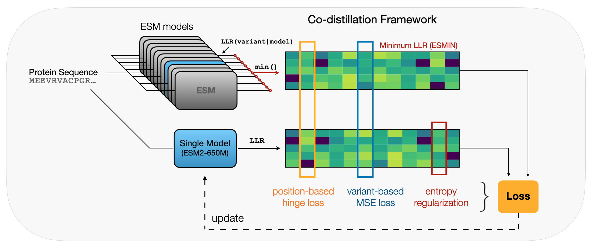

# VESM: Co-distillation of ESM models for Variant Effect Prediction


[](https://colab.research.google.com/github/ntranoslab/vesm/blob/main/notebooks/VESM_Getting_Started.ipynb)

- [Installation ](#installation)
- [Quickstart](#quickstart)
- [Example Usage](#usage)
- [Training](#training)
- [Zero-shot Prediction](#inference)
- [License](#license)

This repository contains resources, code and tools for the VESM protein language models developed in the paper ["VESM: Compressing the collective knowledge of ESM into a single protein language model"](vesm_arxiv) by Tuan Dinh, Seon-Kyeong Jang, Noah Zaitlen and Vasilis Ntranos.

<p align="center">
  
</p>

---

- **Proteome-wide‬‭ VESM‬‭ predictions**:‬‭‬‭ Precomputed‬‭ VEP‬‭ scores‬‭ for‬‭ all‬‭ VESM‬‭ models‬ are‬‭ available‬‭‬ at https://huggingface.co/datasets/ntranoslab/vesm_scores

- **Interactive web portal**: VESM‬‭ predictions‬‭ are also available‬‭ in‬‭ an‬‭ interactive‬
web portal at https://huggingface.co/spaces/ntranoslab/vesm-variants

## Installation <a name="installation"></a>

To get started with VESM, you should have PyTorch and [conda](https://www.anaconda.com/) installed to use this repository.
You can follow this command for installing the conda environment:
```bash
conda env create --name vesm --file=environment.yml
```

---
## Quick start <a name="quickstart"></a>
A simple way to get started is to run our notebook [](https://colab.research.google.com/github/ntranoslab/vesm/blob/main/notebooks/VESM_Getting_Started.ipynb) directly on a Google Colab instance.

## Usage  <a name="usage"></a>

Pretrained VESM models can be loaded through our huggingface library: https://huggingface.co/ntranoslab/VESM.
```py
import torch
from huggingface_hub import hf_hub_download
from transformers import AutoTokenizer, EsmForMaskedLM

# load function
def load_vesm_model(model_name="vesm1", local_dir="vesm", device='cuda'):
    if model_name == 'vesm3':
        ckt = "esm3_sm_open_v1"
    elif model_name in ["vesm1"]:
        ckt = 'facebook/esm1b_t33_650M_UR50S'
    elif model_name in ["vesm2"]:
        ckt = 'facebook/esm2_t33_650M_UR50D'
    else:
        print("Model not found")
        return None

    # download weights
    hf_hub_download(repo_id="ntranoslab/vesm", filename=f"{model_name}.pth", local_dir=local_dir)
    # load base model
    if model_name == "vesm3":
      from esm.models.esm3 import ESM3
      model = ESM3.from_pretrained().to(device).float()
      tokenizer = model.tokenizers.sequence
    else:
      model = EsmForMaskedLM.from_pretrained(ckt).to(device)
      tokenizer = AutoTokenizer.from_pretrained(ckt)
    # load pretrained VESM
    model.load_state_dict(torch.load(f'{local_dir}/{model_name}.pth'))
    return model, tokenizer
  
def load_vesm(local_dir="vesm", device='cuda'):
    vesm1, tokenizer = load_vesm_model('vesm1', local_dir=local_dir, device=device)
    vesm2, _ = load_vesm_model('vesm2', local_dir=local_dir, device=device)
    models = {
        'vesm1': vesm1,
        'vesm2': vesm2
    }
    return models, tokenizer
```

### Predict Variant Effects

```py
# scoring functions
import torch.nn.functional as F
# calcualte log-likelihood ratio from the logits 
def get_llrs(sequence_logits, input_ids):
    token_probs = torch.log_softmax(sequence_logits, dim=-1)
    wt_positions = F.one_hot(input_ids, num_classes=token_probs.shape[-1])
    wt_probs = token_probs * wt_positions
    wt_probs = wt_probs.sum(dim=-1, keepdim=True)
    # add alpha 
    llrs = token_probs - wt_probs.expand(token_probs.shape)
    return llrs

# compute mutant score
def score_mutant(llrs, mutant, sequence_vocabs):
    mutant_score = 0
    for mut in mutant.split(":"):
        _, idx, mt = mut[0], int(mut[1:-1]), mut[-1]
        pred = llrs[idx, sequence_vocabs[mt]] 
        mutant_score += pred.item()
    return mutant_score
```

#### Sequence-only Models 

Here, we provide sample scripts to compute mutant scores on VESM, VESM1, and VESM2.
```py
# sequence and mutant examples
sequence = "MVNSTHRGMHTSLHLWNRSSYRLHSNASESLGKGYSDGGCYEQLFVSPEVFVTLGVISLLENILV"
mutant = "M1Y:V2T"
```

```py
# Setting
local_dir = 'vesm' # local directory to store models
gpu_id = 0 # GPU device
device = torch.device(f'cuda:{gpu_id}') if torch.cuda.is_available() else 'cpu'

# Inference function on a single sequence (not longer than 1022 amino acids)
def inference(model, tokenizer, sequence, device):
    tokens = tokenizer([sequence], return_tensors='pt').to(device)
    with torch.no_grad():
        outputs = model(**tokens)
    logits = outputs['logits'][0]
    input_ids = tokens['input_ids'][0]
    # calcualte log-likelihood ratio from the logits 
    llrs = get_llrs(logits, input_ids)
    return llrs

"""
    Prediction with VESM 
"""
models, tokenizer = load_vesm(local_dir=local_dir, device=device)
sequence_vocabs = tokenizer.get_vocab()
# compute mutant score
mutant_score = 0
for k, model in models.items():
    # calcualte log-likelihood ratio from the logits 
    llrs = inference(model, tokenizer, sequence, device)
    # add model's score
    mutant_score += score_mutant(llrs, mutant, sequence_vocabs)
# prediction score
mutant_score = mutant_score / len(models)
print("Predicted score by VESM: ", mutant_score)


"""
    Prediction with VESM1 or VESM2
"""
# load vesm models
model_name = 'vesm2'
model, tokenizer = load_vesm_model(model_name, local_dir=local_dir, device=device)
sequence_vocabs = tokenizer.get_vocab()
# calcualte log-likelihood ratio from the logits
llrs = inference(model, tokenizer, sequence, device)
# scoring
mutant_score = score_mutant(llrs, mutant, sequence_vocabs)
print(f"Predicted score by {model_name}: ", mutant_score)
```

#### Using Structure with VESM3
```py
from esm.sdk.api import ESMProtein

# A sample structure pdb
# !wget https://alphafold.ebi.ac.uk/files/AF-P32245-F1-model_v4.pdb
pdb_file = "data/AF-P32245-F1-model_v4.pdb"
protein = ESMProtein.from_pdb(pdb_file)
mutant = "M1Y:V2T"
```

```py
# load model
model, tokenizer = load_vesm_model('vesm3', local_dir=local_dir, device=device)
sequence_vocabs = model.tokenizers.sequence.vocab

# inference
tokens = model.encode(protein)
seq_tokens = tokens.sequence.reshape(1,-1)
struct_tokens = tokens.structure.reshape(1,-1)
with torch.no_grad():
  outs = model.forward(sequence_tokens=seq_tokens, structure_tokens=struct_tokens)
  logits = outs.sequence_logits[0, :, :]
  input_ids = tokens.sequence

# calcualte log-likelihood ratio from the logits 
llrs = get_llrs(logits, input_ids)
# compute mutant score
mutant_score = score_mutant(llrs, mutant, sequence_vocabs)
print("Mutant score: ", mutant_score)
```

---
## Training VESM <a name="training"></a>
We provide scripts to train a VESM model from existing pretrained ESM checkpoints.

**Prepare Dataset**: Download the precomputed [ESMIN](https://huggingface.co/datasets/ntranoslab/vesm_scores/blob/main/ESMIN_UniProt.pkl) dataset into the ```data``` folder.

**Training scripts**

Edit the configs.json file to input the model name, e.g., esm2_8m under models/model_name
```py
python main.py --gpu_id <gpu_id> --batch_size <training_batch_size>
```

## Zero-shot Variant Effect Prediction <a name="inference"></a>
We provide scripts to predict variant effect scores on two benchmarks: ProteinGym ClinVar and ProteinGym DMS.

**Prepare Dataset**:
We provide the corresponding data in the the ```data``` folder, arranged in the following format:
```
data/
|——ClinVar
|——|——ClinVar_sequences.csv
|——|——ClinVar_variants.csv
|——|——...
```
**Inference on ProteinGym ClinVar Dataset**

```py
python inference.py --gpu_id <gpu_id> --model_name <model_name> --ckt <checkpoint_name> --data ClinVar
```

**Inference on ProteinGym DMS Dataset**
```py
python inference.py --gpu_id <gpu_id> --model_name <model_name> --ckt <checkpoint_name> --data DMS
```

**Example**
```py
python inference.py --gpu_id 0 --model_name esm1b --ckt vesm1 --data ClinVar
```

## License  <a name="license"></a>

The source code and model weights for VESM1 and VESM2 are distributed under the MIT License. The VESM3 model is a fine-tuned version of ESM3-Open (EvolutionaryScale) and is available under a [non-commercial license agreement](https://www.evolutionaryscale.ai/policies/cambrian-open-license-agreement). Please see [LICENSE.md](./LICENSE) for details.
